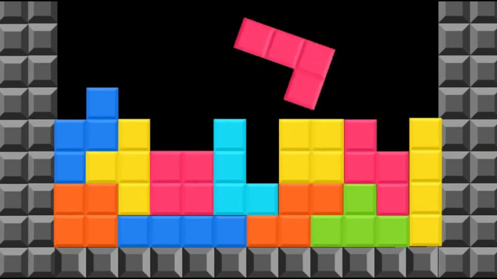

## Tetris lite

---

### Descripción

Este es un simple juego de Tetris implementado en HTML, CSS y JavaScript. El desafío clásico del Tetris es manipular bloques que caen para crear filas sólidas y evitar que los bloques alcancen la parte superior del área de juego.

### Cómo Jugar

1. Abre el archivo `index.html` en tu navegador.
2. Utiliza las teclas de flecha para mover y rotar los bloques que caen.
3. Intenta crear filas sólidas sin que los bloques lleguen a la parte superior del área de juego.

### Funcionalidades

- Utiliza las teclas de flecha para mover y rotar los bloques.
- Bloques que caen con diferentes formas.
- Elimina filas para ganar puntos.
- Alerta de fin del juego y recarga de la página.

### Cómo Contribuir

Si quieres contribuir al desarrollo del juego, sigue estos pasos:

1. Haz un fork del repositorio.
2. Clona tu fork: `git clone https://github.com/TU_USUARIO/tetris-game.git`
3. Crea una rama para tus cambios: `git checkout -b tu-rama`
4. Realiza tus modificaciones y haz commit: `git commit -m "Añadir nuevas funcionalidades"`
5. Sube tus cambios: `git push origin tu-rama`
6. Abre un Pull Request en GitHub.

¡Agradecemos tus contribuciones! Además, sígueme en mis redes sociales para apoyar este proyecto y otros a través de este enlace: [https://linktr.ee/mario.conf](https://linktr.ee/mario.conf).

---

## Tetris lite

---

### Description

This is a simple Tetris game implemented in HTML, CSS, and JavaScript. The classic Tetris challenge is to manipulate falling blocks to create solid rows and prevent the blocks from reaching the top of the game area.

### How to Play

1. Open the `index.html` file in your browser.
2. Use the arrow keys to move and rotate the falling blocks.
3. Try to create solid rows without reaching the top of the game area.

### Features

- Use arrow keys for block movement and rotation.
- Falling blocks with different shapes.
- Clear rows to earn points.
- Game over alert and page reload.

### How to Contribute

If you want to contribute to the development of the game, follow these steps:

1. Fork the repository.
2. Clone your fork: `git clone https://github.com/YOUR_USERNAME/tetris-game.git`
3. Create a branch for your changes: `git checkout -b your-branch`
4. Make your modifications and commit: `git commit -m "Add new features"`
5. Push your changes: `git push origin your-branch`
6. Open a Pull Request on GitHub.

We welcome your contributions! Also, follow me on my social media to support this project and others through this link: [https://linktr.ee/mario.conf](https://linktr.ee/mario.conf).
